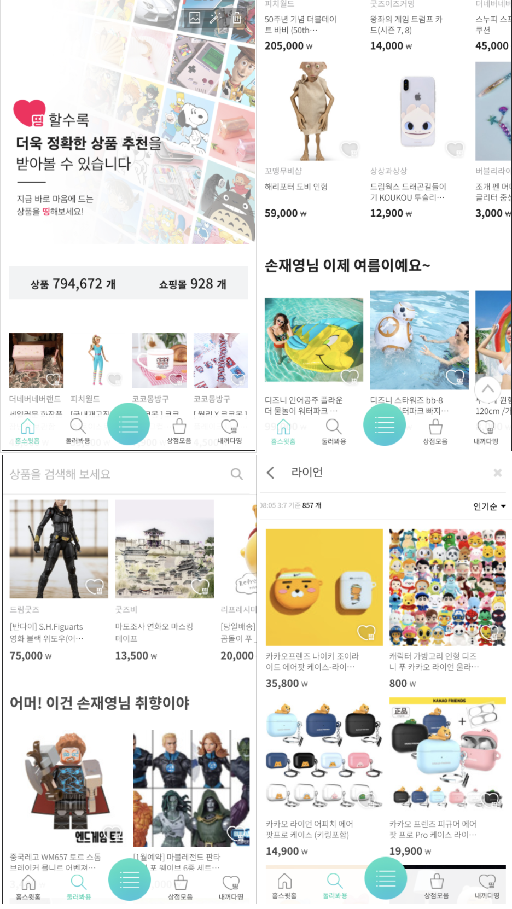
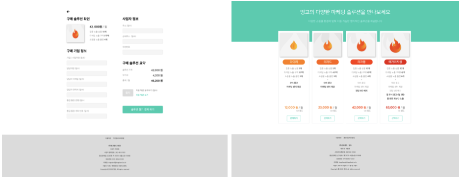
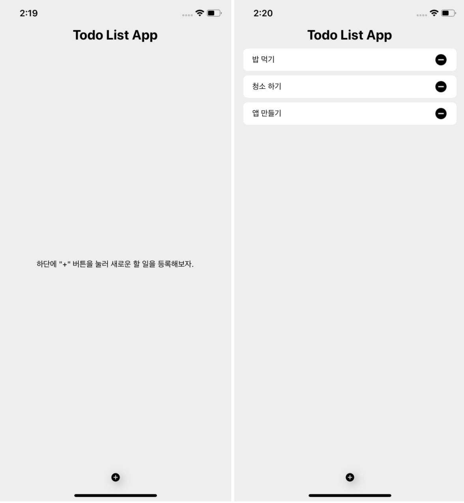
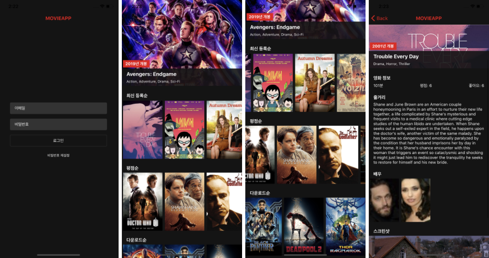
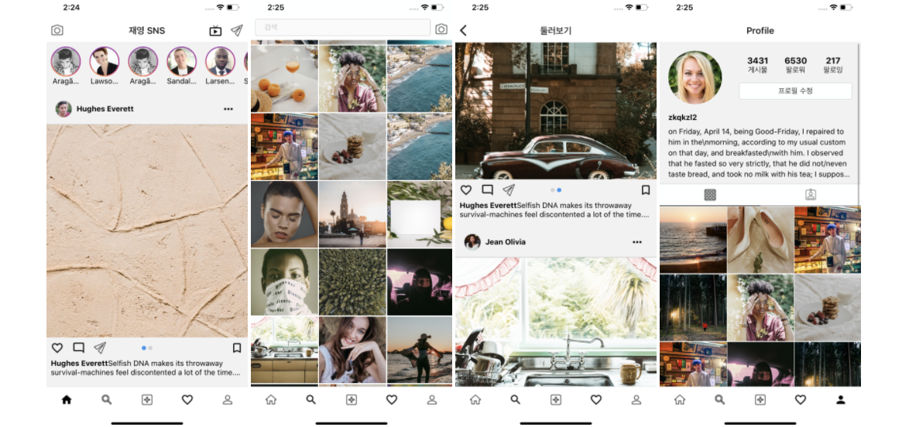
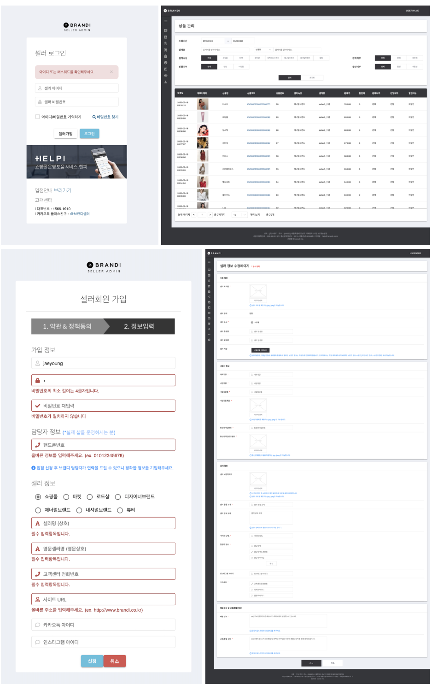
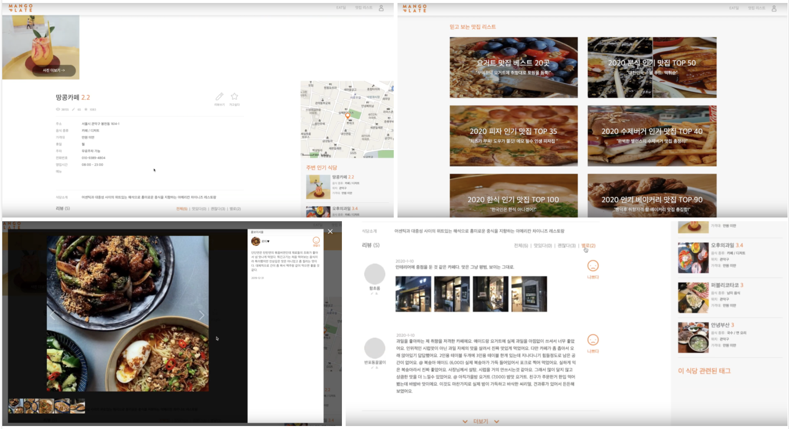
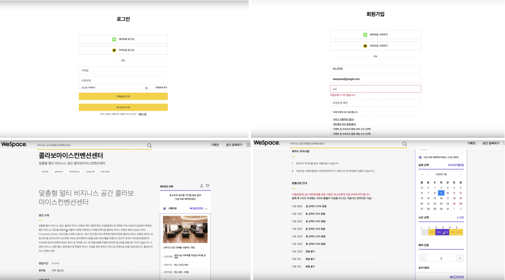

# 손재영

성실함을 기반으로 새로운 기술을 알아가는 것을 좋아합니다.  
사용자들이 이용하며 즐거움을 느낄 수 있는 웹을 만들고 싶어합니다.

|            |                                 |
| :--------: | ------------------------------- |
| **Github** | https://github.com/jaeyoung-son |
|  **Blog**  | https://jyblog.netlify.app/     |
| **E-mail** | zkqkzl2@gmail.com               |

## 기술 이력

## HTML, CSS

- Semantic MarkUp을 준수하기위해 노력합니다.
- Document Object Model(DOM)을 이해하고 있습니다.
- CSS, SCSS, Styled-Components를 다룹니다.
- Media query를 사용하여 반응형 웹을 다룹니다.
- flex layout에 익숙합니다.

## Javascript

- ES5와 ES6 이후의 문법에 익숙합니다.
- 자바스크립트 closure를 이해하고 있습니다.
- promise, async await 비동기 처리를 이해하고 있습니다.

## React

- SPA를 이해하고 있습니다.
- LifeCycle method를 적절히 다룹니다.
- 전역상태관리(Redux)를 다룹니다.
- Hooks를 다루며 함수형 컴포넌트를 사용합니다..
- Webpack을 사용한 빌드 경험이 있습니다.

## 기타

- Version Control(Git)을 이용한 협업에 익숙합니다.
- react-native에 관심이 있어 학습하였습니다.

<!-- 

 -->

## 개발 경력

### 틴고랜드

2020.04 ~ 2020.08

- ### 메인화면 리뉴얼 프로젝트

  

  메인화면(홈) 및 상품검색 페이지 리뉴얼 프로젝트  
   웹앱 기반의 어플리케이션 개발  
   관리자 페이지에서 메뉴, 아이템이 커스터마이징이 가능한 프로젝트 아이템  
   cpm, cpc 로그추적 구현  
   타입스크립트 사용

- ### 판매자 입점 정기구독 결제 페이지

  

  Clayful, iamport 웹훅 연동, 입점 정기구독 서비스 개발

  <!-- 
  
  
  
   -->

### 리액트 네이티브

- ### 할일 목록 앱

  

- ### 영화 소개 앱

  

- ### SNS 앱

  

### wecode(위코드)

##### - 2019.11 ~ 2020.02

## 프로젝트

- ### 기업협업 인턴쉽 : Brandi 어드민페이지 클론 및 리뉴얼

  ( 20.01.28 ~ 20.02.21 )

  <!-- 
  
  
  
   -->

  ### 역할

  

  로그인 및 회원가입페이지, 셀러정보, 샐러목록 페이지  
  CKEditor 를 사용하여 상품등록 에디터 구현  
  Webpack 을 활용한 빌드  
  Material-UI 사용  
  Crypto.js 를 사용하여 아이디 저장 기능 구현  
  전역 상태관리 Redux 활용  
  params 속성을 활용하여 유동적인 리스트 구현

  ### 후기

  기업협업 인턴쉽을 경험한 프로젝트입니다. 회사에서 실무를 경험하면서 어떤식으로 진행이 되는지 배웠습니다.
  진행한 프로젝트는 쇼핑몰 어드민페이지 리뉴얼 프로젝트였습니다. 회원가입 페이지나 셀러정보 페이지가 관리할 input창이 많아서 관리하는데 어려움이 있었고 웹팩을 처음 활용해서 빌드를 해나가며 개념을 잡았습니다. Redux를 더욱 활용하며 이해할 수 있었고 배운게 많았던 프로젝트입니다.

- ### 2차 프로젝트 : MangoPlate 클론

  ( 20.01.06 ~ 20.01.17)

  ### 역할

  
  레스토랑 상세페이지, 탑리스트 및 맛집리스트 페이지 담당  
   React-hooks를 활용한 함수형 컴포넌트 사용  
   Styled-component를 이용해 스타일 및 이벤트 적용  
   React-redux를 사용해 토스트창 구현  
   Styled-component로 이미지 캐러셀 기능 구현  
   백엔드와 API호출하며 더보기 기능 구현

  ### 후기

  이번에 프로젝트를 하면서 처음으로 Redux와 Styled-component, Hooks를 적용했습니다. 액션이며 리듀서며 디스패치며 개념이 이해하기 어렵고 힘들었지만 간단한 기능은 적용 시킬 수 있었다. 스타일드컴포넌트도 활용도가 무궁무진 하고 아주 효율적으로 쓸 수 있을것같다고 느꼈습니다. 훅스 개념도 많이 사용하면서 함수형 컴포넌트 에대한 개념도 잡았습니다.

* ### 1차 프로젝트 : SpaceCloud 클론

  ( 19.12.23 ~ 20.01.03)

  ### 역할

  
  로그인 및 회원가입 페이지, 공간정보 상세페이지 담당  
   class형 컴포넌트를 사용 & 라이프사이클 메소드를 통한 api연결  
   css를 이용한 모달기능 구현  
   로그인 페이지 유저 access_token 관리  
   QnA부분 pagenation 기능구현  
   React calendar 라이브러리를 활용한 예약기능 구현  
   React Router 사용

  ### 후기

  리액트를 사용한 첫 프로젝트 였기에, 기본기가 많이 부족한 상태에서 시작한 프로젝트 입니다. 진행하면서 props와 state개념을 잡을 수 있었고, 로그인 회원가입 페이지를진행하면서 JWT토큰을 이용한 로그인 인증을 배웠고 문제가 생길때 해결해나가는 요령을 터득한 프로젝트 였습니다. 백앤드와 API를 주고받으며 LifeCycle method 개념도 잡고 협업하는 재미도 느꼈습니다.

