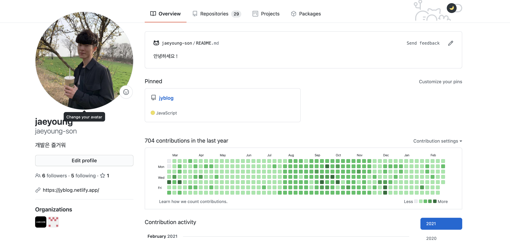
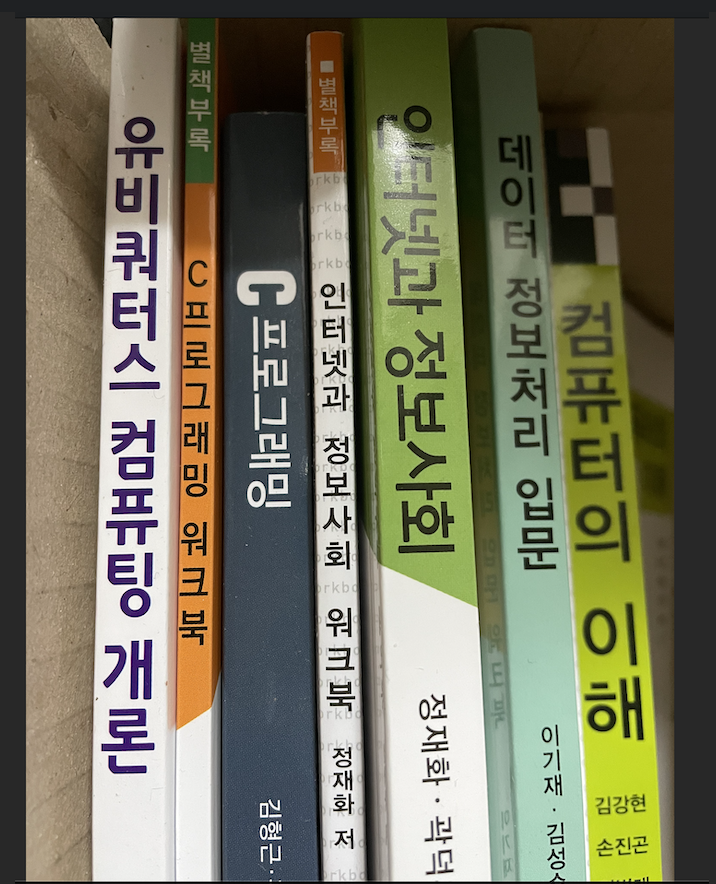

## 글을 쓰는 이유

포스트 타이틀 그대로 어떠한 부분에선 끝이고, 어느 부분에선 시작이고 이것저것 생각하다보니 지난 시간들도 돌아보게되었고... 한번 생각도 정리할겸 쓰게 되었다.

## 뭐가 끝인데?

다름은 아니고

어느샌가 365일 커밋을 완성했다.  
처음엔 단지 스터디 목적으로 블로깅하다보니 며칠 쌓여있었는데 한번 365일도 해보자! 라는 생각으로 시도했다. 나름 뿌듯하다.  
목표를 잡고 실행해 나가다보니 목표의식도 생겨서 자꾸 정리할거리를 찾아서 배우며 정리하고, 그 과정에서 얻는게 상당히 많았다. 지금 돌이켜보면, 정리한 글들이나 자료들, 코드 등 다 내 자산이다.
근데 매일매일 커밋을 어떤 순간에는 기분이 이상하기도 했다. 뭔가 목적 자체는 학습 및 성장, 뿌듯함 이런것들인데 가끔은 목적 자체가 커밋 기록을 남겨야한다 이런 기분이 들기도 하더라. 그럴떄는 별로 하고싶지도 않고 그만두고싶기도 했다. 오히려 기록에 집착해서 기록을 하기위해 억지로 정리하는 느낌이랄까... 약간 그러했다. 그래도 중간에 그만두지는 않았다. 에이 시작했는데 끝은 봐야지 라는 생각도 있었고, 어느샌가 습관이 되어버려서 그냥 자연스럽게 당연히 하는일마냥 하면서 했던 것 같다. 뭐 지금 후기는 매우 뿌듯하고 포기하지 않은 나에게 칭찬도 해주겠다. 뭐 별거(?)는 아니지만..

#### 그럼 앞으로는??

조금 고민이 되었던 부분인데 일단 그만 하기로 결정했다. 왜? 앞으로는 신경을 많이 못쓸거 같고, 전보다 더욱 바빠질 예정이니깐. 물론 바쁘다는건 항상 핑계가 될 수 있다. 근데 사실인데 어떡하겠는가. 나의 하루는 아쉽게도 남들과 같이 24시간이고, 나는 아쉽게도 초인은 아니다.

## 첫 시작 회상

한번 부트캠프를 수료하고 그 후기를 간략하게 남기긴 했었는데, 다시 뒤돌아보니 그때 생각이 많이 났다. 프로그래밍의 프자도 몰랐는데 그냥 하자고 마음먹고 바로 등록해서 배우려고 했는데... 참 그떄 어떻게 그렇게 고민도 많이 안하고 결정했는지 싶다. 그때 당시 배우는 과정동안 다른곳 에서 배우고 온 분들도 있고, 전공을 하신 분들도 있고, 정말 자괴감이 많이 들고 뒤쳐지는게 너무 싫었고 같이 프로젝트하면 내가 못해서 피해주는 일이 생길까봐 나름 월화수목금토일 5시간만 자면서 죽도록 했다. 그래도 그떄도 많이 즐거웠는데, 지금은 그렇게 안하고있다. 나름 반성도 좀 해야겠다.

## 그럼 시작은 뭔데?

- ### 학생

  
  방송통신대학교의 컴퓨터과학과 학생으로 시작을 하게 되었다. 위에서 말한 바빠질 예정이라는 핑계의 한 부분을 차지하기도 한다. 이 역시도 많은 고민이 필요했고, 쉬운 결정은 아니었는데 그래도 해보고 싶기도 했고 나에게 아쉬운 부분이기도 해서 한번 잘 비벼볼(?) 예정이다. 졸업을 하기 위해선 4년이라는 시간과 들어보면 적지 않은 노력이 필요하다고 하는데 내가 잘 할 수 있을지 걱정도 많이 된다. 다음 주 부터 개강이다. 열심히 강의듣고 열심히 배워야겠다. 화이팅

- ### 직장인
  이번주 부터 회사에 출근 직장맨이다. 작년에 재직중인 회사를 퇴사하고 꽤 긴 개인시간을 가지다가 다시 구직을 시작했고 결과적으로 이번주 부터 출근을 했다.
  #### 구직과정..
  구직은 길다면 길고 짧다면 짧은? 약 2달간의 기간동안 진행했는데, 쉽지 않았다. 체력적으로도 정신적으로도 편하지는 않았던것 같다. 이곳저곳 막 찔러보는 타입은 아니기에 채용공고를 보며 괜찮아 보이는 곳들을 지원했다. 채용 공고에 단순 업무, 기술, 뭐 요건 이런것만 적혀있는곳은 피했고 이왕이면 자세히 설명이 되어있고 어떠한 팀이고, 어떠한 팀을 만드려하고 그런 내용들이 잘 기재되어 있는 곳들로 지원했다. 지원 결과 자체는 완전 만족스럽지는 않았다. 서류광탈을 은근 많이 하더라. 물론 나도 내가 서류상으로나 경험으로나 많이 부족하다는걸 알기에 많이 실망하지는 않았다. 그래도 조금은 섭섭하기도 하고, 아쉽기도 하고..  
  반면에 서류를 통과하고 다음 채용 프로세스를 진행하는 곳도 꽤 있었다. 뭐 테스트를 본다던지, 바로 면접을 본다던지, 아마 다음 과정을 진행 하는데에는 몇 가지 이유가 있겠지만 부족한것이 많은 내 서류를 보고도 어쩄든 다음 과정을 진행을 했고, 나는 다음 과정을 진행하는데에 있어서 모든 회사에 어느정도 감사한 마음을 가지고 진행하는 과정동안 최선을 다했다.  
  물론 그것이 끝은 아니다. 뭐 테스트가 있다면 테스트를 통과해야하고, 면접을 본다면 면접을 통과해야하고, 그뿐 아니라 나 역시도 회사를 선택할 권리가 있고 나도 마음에 드는 회사를 가야 개인적으로도 더 퍼포먼스가 나오고 발전이 있다고 생각한다. 뭐 당연한 얘기일자도 모르겠다.
  물론 면접을 진행하면서 내가 별로라고 생각했던 회사들도 있을테고, 나 역시도 가고싶지 않은 마음이 드는 회사들이 있었다. 면접 자리에서 전반적인 것을 판단하는것은 옳지 않다.
  다만 서로 질의 응답하고 소통하는 과정에서 느껴지는 무언가가 있는데, 아 이게 말로는 설명이 잘 안되는 듯 하다.  
  그러다가 최종적으로 오퍼를 몇 군데 받기는 했다. 물론 그렇게 받다보면 나는 하나의 회사를 선택할 수 밖에 없고, 내가 선택하지 않은 회사들에게는 오퍼를 거절해야 한다. 거절 하는것도 쉽지는 않더라. 쉽지 않다기보단 편하지 않았다 라고 하는게 맞는것 같다. 그래도 어느정도 나라는 사람을 확인하고 인정해주고 제안을 했을테니깐.  
  각 회사들 마다 보수나 근무 조건이나 이런것들도 다 달랐고, 그 중에 선택을 해야 하긴 하는데... 뭐 간단한 선택은 아니었다. 보수 자체는 그렇게 크게 비중을 두지는 않았다. 뭐 돈 천만원 차이나는것도 아니고, 내 능력이 뒷받침 되면 보수는 알아서 따라오기 마련이니깐. 그렇게 고민을 하면서 다른 채용과정도 진행 하던 중 지금 회사를 만났다. 사실 뭐 테스트를 보고 1차 인터뷰를 한 뒤 어느정도 마음을 정했다. 1차 인터뷰 과정이 편하지 않은 면접 인데도 불구하고 진행 하면서 너무 즐거웠다. 물론 인터뷰 진행하시는 분이 나를 그렇게 해주신 거니깐 그렇겠지. 그 후 다음 과정을 진행하면서도 나는 이곳에 가고싶다는 마음이 강하게 들었고 이분들과 일을 같이 해보고 싶다는 생각이 들었다. 그래서 큰 고민 없이 결정할 수 있었고 최종 과정을 마친 뒤 떨리는 마음으로 기다렸다.
  다행히도 좋은 결과를 주셨고, 함께 하기로 결정했고, 이번 주 부터 출근을 시작했다.
  #### 어떤데 지금회사?
  말했다시피 출근한지 일주일 밖에 안되었는데 뭐 이렇다 저렇다 할 수 없고 그렇다. 다만 나는 출근한 첫 날부터 회사에 있는 시간이 많이 정신도 없고, 적응도 잘 안되었고, 하긴 했지만 많이 만족스러웠다.
  일단 지금 당장 업무 테스크를 맡은건 아니고 업무 적응 과정 가지며React가 아닌 Vue를 새롭게 이번에 배우고 있다. 어쩄든 그렇다. 팀원분들께서도 너무 많이 배려해주시고, 신경써주시고, 감사한게 많다. 그래서 나는 열심히 해서 실망시켜드리고 싶지 않은 마음이 크다. 하나의 구성원으로서 앞으로 다양한 도전들을 해나가며 함께 성장하고 발전하고 그렇게 해나가고 싶다. 이러한 소속감도 생기게 되었다. 내가 성격상 원래 걱정도 많고 쓸데없는 부분까지 신경 쓰기에 내가 잘하려나, 실망시켜드리진 않을지 걱정도 많이 되고 그렇지만 걱정해봐야 뭐하겠나 다 부질없고 열심히 해서 좋은 결과를 만들어내면 되는것이다.그래서 앞으로 업무를 진행해나가며 다양한 도전들을 하게될텐데 한편으로는 설레기도 한다. 즉 매일매일 새로 배워 나가는 과정이 쉽지는 않지만 즐겁게 임하고 있다. 어쨌든 나는 이런 회사에 훌륭하고 멋진 팀원들과 함께 한다. 그에 부끄럽지 않고 부족하지 않게 열심히 해 나갈 것이다.

## Vue를 배운다고?

아무래도 현재 회사에서 Vue와 React를 둘 다 사용하다 보니 뷰를 다뤄야 한다. 전에 브랜디에 있을때는 잠깐 맛만보고 숙지하지 못했는데 그때 좀 더 잘해둘걸 아쉬웠다. 아무래도 그때보다는 더 수월하게 배우고 있으나, 역시 많이 생소하고 리액트와 비슷하면서도 다른 부분이 좀 많다.
사고 자체를 조금 다르게 해야할 것 같다는 생각도 든다. 막 쉽지는 않지만, 나름 재밌게 배우고 있다. 팀장님이 도와주시기도 하고... 많이 감사하다. 빨리 리액트처럼 다룰 수 있게 끌어 내서 뷰 업무도 처리 해야겠다.

## 부족한것들

요즘 점점 나에게 부족한 것들을 느끼고있다. 이러한 것들을 느껴서 시작한게 위에서 시작한다는 학교 생활이다. 종종 이쪽으로 아쉬움을 느끼곤 했는데, 그래서 잘 배워서 전공하자 라는 도전을 시작하게 되었다.
또한 요즘 영어도 많이 아쉬운것 같다. 요즘 워낙 각종 번역기나 툴들이 잘 되어있어서 어느정도 커버가 가능하지만, 아무래도 능숙히 다루는 것 과는 차이가 있다. 개발 특성 상 영어로된 docs나 자료를 참고 할 것들이 많고, 커뮤니케이션을 할 때도 원활한 소통이 안될 수 있다. 그래서 이 부족한 영어를 채우고자 조금 알아보니, 뭐 토익 토플같은 시험이 아닌 reading,writing,listening 같은 실질적인 영어능력을 향상시켜준다는 학원(?)이 있더라. 한번 상담받고 괜찮다 싶으면 등록도 할 예정이다.

## 이제 끝

나는 이러한 같은 끝이 있었고, 이러한 시작이 있다. 앞으로도 부족한 것들이 있다면 채워나가고 그에 따른 도전들을 즐기며 열심히 해야겠다. 가끔 늘어진다면 다시 이 글을 찾아서 봐야겠다 화이팅~!
